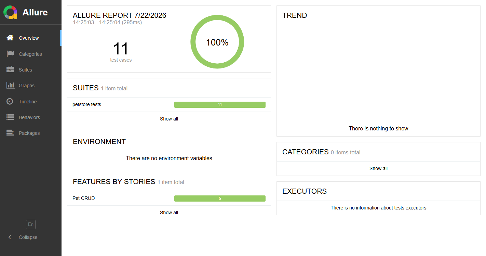
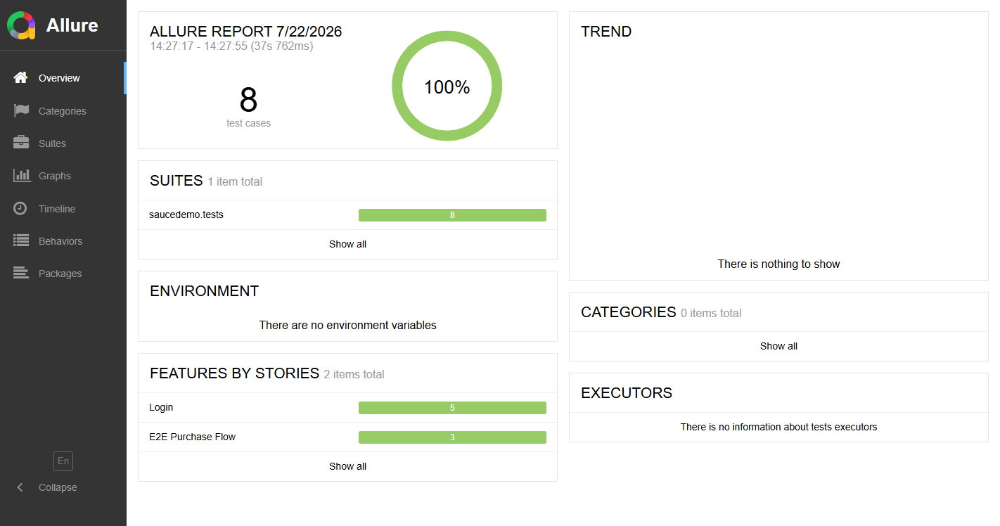
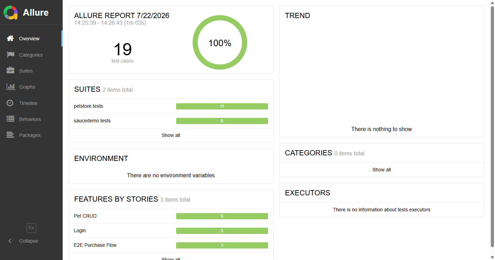

# Autotests Project

API и UI автотесты для Swagger Petstore и SauceDemo.

- **API тесты** — Mock Petstore на `http.server` (stdlib), никаких внешних зависимостей
- **UI тесты** — SauceDemo через Selenium + ChromeDriver (Selenium Manager)

## Установка

```bash
pip install -r requirements.txt
```

## Переменные окружения

Скопируйте `.env.example` в `.env` и настройте под свою среду:
```bash
cp .env.example .env
```

## Запуск тестов

```bash
python tasks.py test          # все тесты
python tasks.py test-api      # только API
python tasks.py test-ui       # только UI
python tasks.py test-parallel # параллельно
```

Или напрямую через pytest:
```bash
pytest -m api
pytest -m ui
pytest -n auto
```

## Генерация отчёта

Отчёт и скриншоты генерируются автоматически после каждого прогона тестов.

Скриншоты сохраняются в `screenshots/` с фиксированными именами:
- `screenshots/all.png` — все тесты
- `screenshots/api.png` — только API тесты
- `screenshots/ui.png` — только UI тесты

Для ручной генерации:
```bash
python tasks.py report          # открыть Allure отчёт
python tasks.py screenshot      # скриншот отчёта (все тесты)
python tasks.py screenshot-api  # скриншот API отчёта
python tasks.py screenshot-ui   # скриншот UI отчёта
```

## Очистка

```bash
python tasks.py clean
```

Все команды:
```bash
python tasks.py --help
```

## Структура проекта

```
├── config/                  # Конфигурация (.env → settings.py)
├── petstore/                # API тесты (Swagger Petstore)
│   ├── api/                 # API клиент и эндпоинты
│   │   ├── client.py
│   │   └── endpoints/
│   ├── schemas/             # Pydantic-схемы валидации
│   ├── mock_server.py       # Mock Petstore на http.server
│   └── tests/               # API-тесты (pytest -m api)
├── saucedemo/               # UI тесты (SauceDemo)
│   ├── pages/               # Page Object Model
│   └── tests/               # UI-тесты (pytest -m ui)
├── utils/                   # Общая инфраструктура
│   ├── browser_utils.py     # Поиск браузера
│   └── screenshot_report.py # Скриншот Allure-отчёта
├── conftest.py              # Корневой conftest (mock server, base_url)
├── tasks.py                 # Команды для разработчика
├── pyproject.toml           # Конфигурация проекта
├── .env.example             # Шаблон переменных окружения
└── requirements.txt         # Зависимости
```

## Отчёт — API тесты



## Отчёт — UI тесты



## Отчёт — Все тесты



## Mock Petstore

`petstore/mock_server.py` имплементирует REST-endpoints:
- `POST /v2/pet` — создать питомца
- `GET /v2/pet/{id}` — получить по ID
- `PUT /v2/pet` — обновить
- `DELETE /v2/pet/{id}` — удалить
- `GET /v2/pet/findByStatus` — поиск по статусу

Стартует автоматически в conftest.py.
